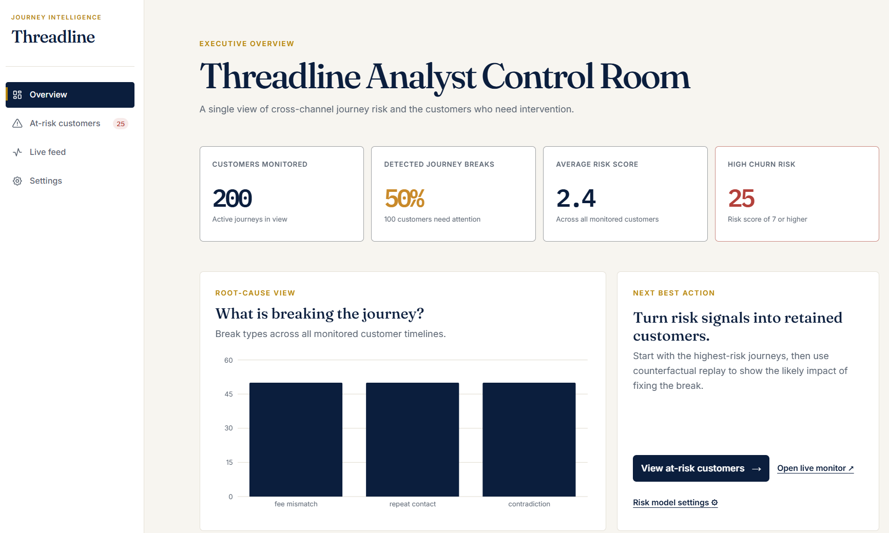
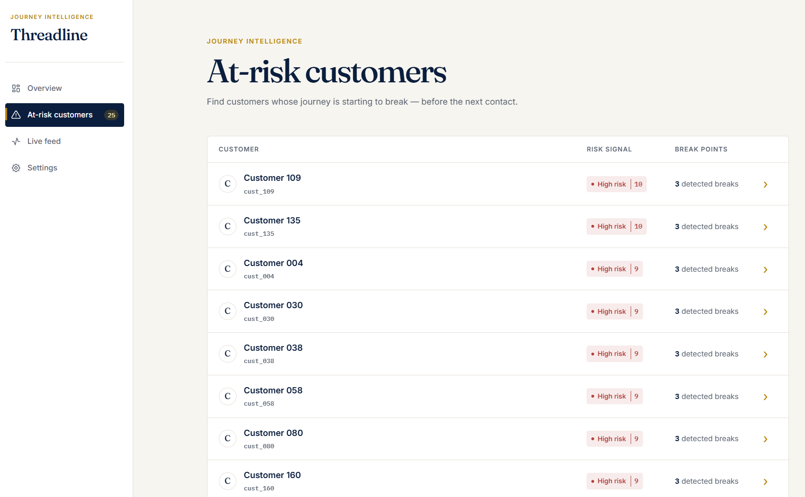
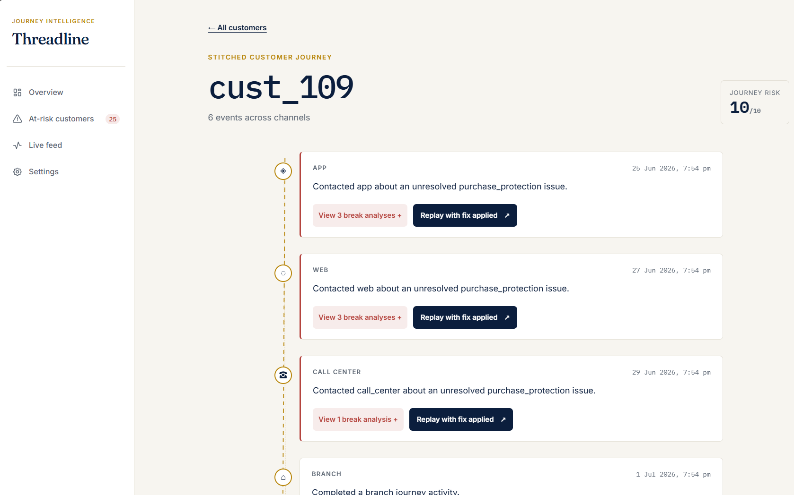
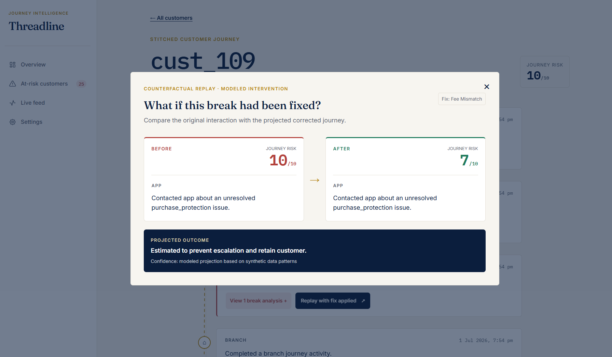
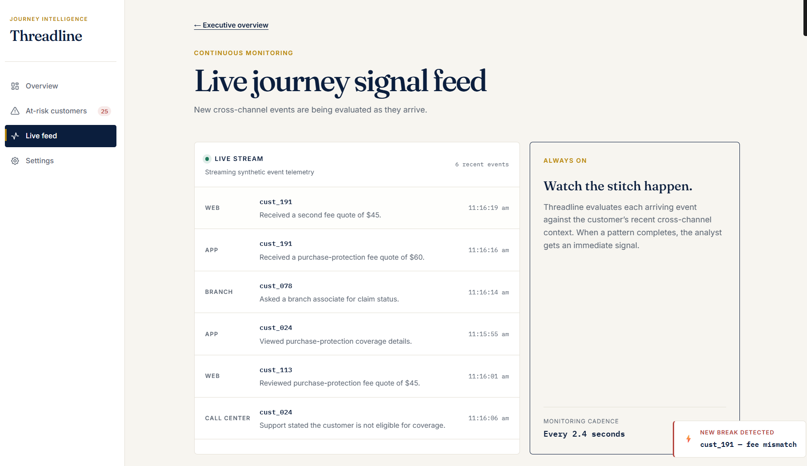
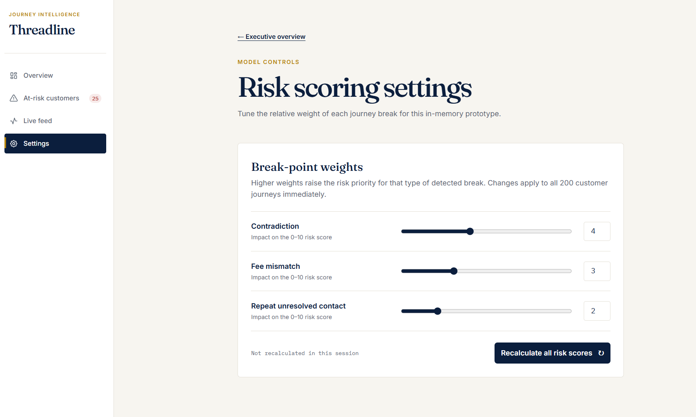
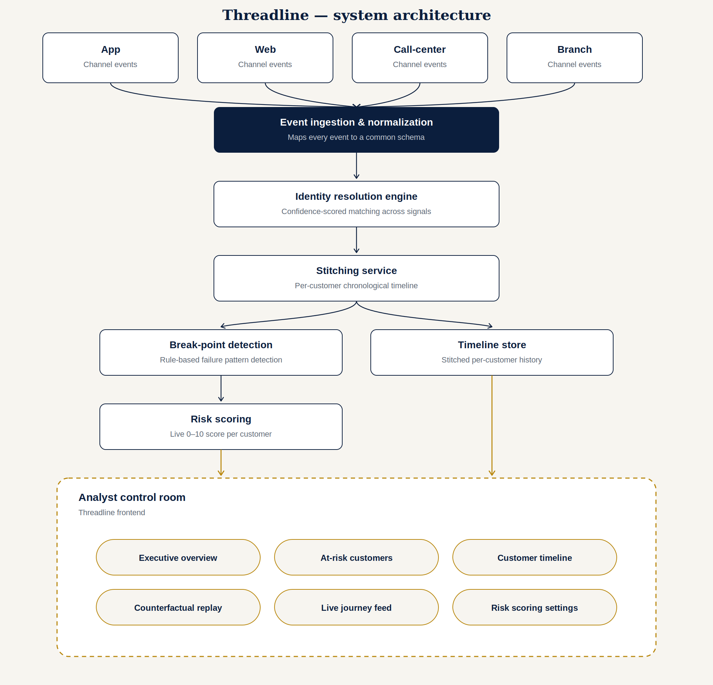

# Threadline

**Find the moment the journey broke — before the customer does.**

Threadline is a cross-channel identity resolution and journey-stitching engine built for **CodeStreet 2026** (theme: *Cross-Channel Journey Stitching*). It reconstructs a customer's full journey across app, web, call-center, and branch touchpoints into a single timeline, automatically flags the exact moment trust broke, and proves — through a counterfactual replay — what would have happened if the right intervention had occurred.

---

## Table of contents

- [The problem](#the-problem)
- [The solution](#the-solution)
- [Core features](#core-features)
- [Screenshots](#screenshots)
- [Architecture](#architecture)
- [Tech stack](#tech-stack)
- [Getting started](#getting-started)
- [Project structure](#project-structure)
- [Success metrics](#success-metrics)
- [Assumptions & constraints](#assumptions--constraints)
- [Roadmap](#roadmap)
- [Team](#team)

---

## The problem

A card member's relationship with a company doesn't live in one place — it's scattered across the app, the website, call-center conversations, and branch visits. Today, none of these channels know what the others said. A customer can be quoted one fee on the app and a different one on a call, file a complaint that never reaches the next agent who sees them, or make three separate contact attempts that look, to each individual channel, like three unrelated first-time interactions.

The result isn't just a bad experience — it's an **invisible** one. By the time a customer escalates or churns, the damage is already done, and no one can point to the exact moment things went wrong because no one was looking at all four channels as a single story.

## The solution

Threadline stitches every customer's cross-channel events into one chronological timeline, automatically detects the patterns that signal a breaking journey, and — uniquely — lets you **replay the journey with a fix applied** to see the projected outcome change, before you commit to an intervention.

Where a typical "unified customer view" dashboard stops at visualization, Threadline goes one step further: it moves from *showing what happened* to *explaining why it mattered* and *proving what would fix it*.

## Core features

| Feature | What it does |
|---|---|
| **Identity resolution** | Links a customer's app, web, call-center, and branch events into one identity using confidence-scored matching across shared signals (loyalty ID, phone, email, device fingerprint) — not just exact-ID joins |
| **Real-time stitching pipeline** | Ingests and normalizes events from all four channels into one continuously-updated timeline per customer |
| **Analyst control room** | A visual timeline per customer with break-points highlighted in plain language, not error codes |
| **Break-point detection** | Rule-based detectors for fee mismatches, repeated unresolved contacts, and cross-channel contradictions |
| **Churn-risk scoring** | Every journey carries a live risk score (0–10) that rises as break-points accumulate |
| **Counterfactual replay** | Replays a broken journey with the fix applied, showing the before/after risk score and a projected outcome |
| **Executive overview** | Aggregate view of customers monitored, break-type distribution, and high-risk counts for a business-level read |
| **Live journey feed** | Simulated real-time event stream showing continuous monitoring, not batch processing |
| **Risk model controls** | Tunable break-point weights, so the scoring model can be adjusted without a redeploy |

## Screenshots

> Screenshots are served from `frontend/public/`.

| Executive overview | At-risk customers |
|---|---|
|  |  |

| Stitched customer journey | Counterfactual replay |
|---|---|
|  |  |

| Live journey feed | Risk scoring settings |
|---|---|
|  |  |

**[Watch the demo video](#)** ← add your video link here

## Architecture




Four channel sources emit raw interaction events, which are normalized into a common schema, matched to a customer identity, and stitched into a chronological timeline. A detection layer scans each updated timeline for known failure patterns, updates a live risk score, and surfaces both to the Analyst Control Room frontend — including the counterfactual replay engine, which recomputes risk against a "fixed" version of the same journey.


## Tech stack

**Frontend**
- Next.js (React)
- Tailwind CSS
- Recharts (break-type distribution chart)

**Backend**
- Python, FastAPI
- In-memory / MongoDB for the timeline store (prototype scale)

**Data & matching**
- Synthetic multi-channel event generator (Python)
- Rule-based + confidence-scored identity matching
- Rule-based break-point detectors (fee mismatch, repeat contact, contradiction)

**Tooling**
- Deployed on Vercel (frontend) and Render/Railway (backend) for a live, clickable demo

## Getting started

### Prerequisites
- Node.js 18+
- Python 3.10+

### Backend

```bash
cd backend
python -m venv venv
source venv/bin/activate      # Windows: venv\Scripts\activate
pip install -r requirements.txt
uvicorn main:app --reload
```

Backend runs at `http://localhost:8000`. Check `http://localhost:8000/health` to confirm it's up.

### Frontend

```bash
cd frontend
npm install
npm run dev
```

Frontend runs at `http://localhost:3000`.

### Generating synthetic data

```bash
cd backend
python data_gen/generate.py
```

This creates a synthetic pool of customers with mixed clean and broken cross-channel journeys, used by both the API and the live demo feed.

## Project structure

```
threadline/
├── frontend/           # Next.js app — Analyst Control Room UI
│   ├── app/
│   │   ├── page.tsx            # Executive overview
│   │   ├── customers/          # At-risk customer list
│   │   ├── customer/[id]/      # Stitched journey timeline + replay
│   │   ├── live/                # Live journey signal feed
│   │   └── settings/            # Risk scoring model controls
│   └── components/
├── backend/            # FastAPI service
│   ├── main.py
│   ├── identity_resolution.py
│   ├── stitching.py
│   ├── break_detection.py
│   ├── risk_scoring.py
│   └── data_gen/
│       └── generate.py
├── docs/
│   ├── architecture-diagram.png
│   └── screenshots/
└── README.md
```

## Success metrics

| Metric | What it proves |
|---|---|
| Identity resolution accuracy | % of synthetic multi-channel events correctly linked to the right customer |
| End-to-end stitching latency | Seconds, not hours, from event ingestion to timeline update |
| Break-point detection accuracy | % of seeded broken journeys correctly flagged against a labeled test set |
| Counterfactual replay accuracy | How closely the "fixed" replay matches a held-out journey with no break seeded |
| Risk-score usefulness | Correlation between rising risk score and seeded churn/escalation outcomes |

## Assumptions & constraints

- Real production data isn't available for this competition, so Threadline is built and validated against a purpose-built synthetic dataset with deliberately seeded break-points.
- Identity resolution assumes at least one shared signal (loyalty ID, phone, email, or device fingerprint) exists across a customer's channels.
- Call-center "transcripts" are simulated as structured event summaries rather than raw audio/NLP transcription.
- The counterfactual replay is a modeled projection based on patterns in the synthetic data, intended as a decision-support signal, not a guaranteed real-world outcome.

## Roadmap

- [ ] Replace rule-based break detection with a trained classifier on labeled journey data
- [ ] Real Kafka-based streaming ingestion in place of the simulated live feed
- [ ] NLP-based call-center transcript parsing for richer break detection
- [ ] Role-based access control for the Analyst Control Room
- [ ] Export/report generation for at-risk customer lists

## Team

Built for CodeStreet 2026 by **[Your team name]**.

| Name | Role |
|---|---|
| Adula Vivek Goud | Team Leader |

---

*Threadline — CodeStreet 2026 · Cross-Channel Journey Stitching*